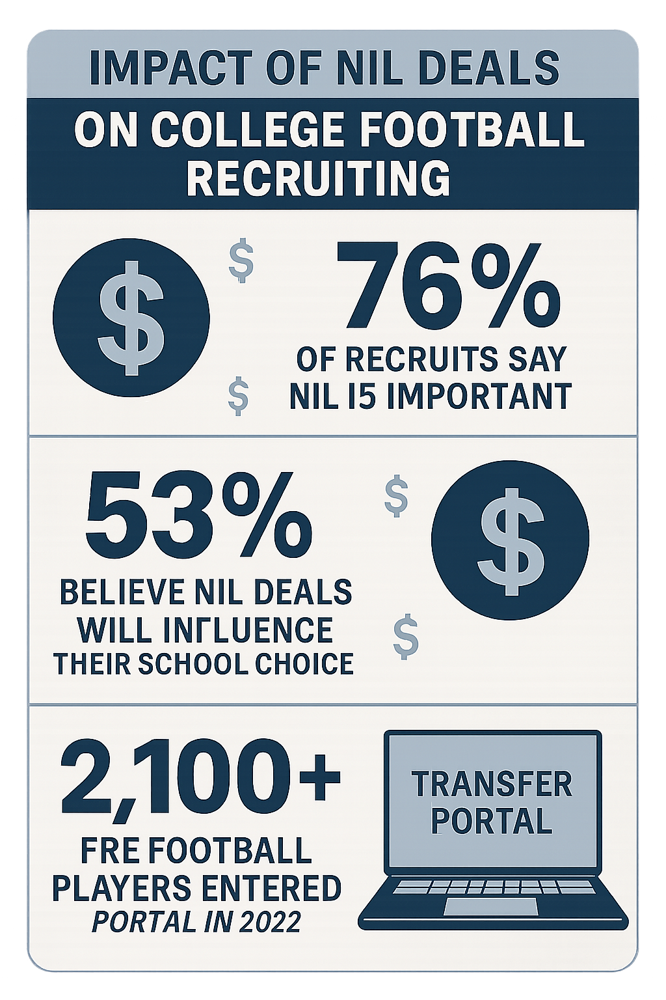

# Darian Mensah’s Historic $8 Million Duke NIL Contract: A New Era for College Football

**In a move that sent shockwaves through the world of college athletics, quarterback Darian Mensah has signed a groundbreaking $8 million, two-year Name, Image, and Likeness (NIL) contract with Duke University. This historic deal not only makes Mensah the highest-paid player in college football history but also signals a transformative shift in the landscape of amateur sports.**

The transfer from Tulane to Duke is more than just a change of scenery for the talented 20-year-old quarterback. It’s a story of ambition, family, and the new financial realities of college football. Mensah’s own words, "I knew this move would set my family up for financial freedom," have resonated across the sports world, highlighting the profound impact of NIL on the lives of student-athletes.

This article delves deep into the Darian Mensah story, exploring his career, the details of his historic Duke transfer, the specifics of the record-breaking NIL contract, and the broader implications for the future of college football.

## From High School Star to Elite College Quarterback

Darian Mensah’s journey to becoming a multi-million-dollar quarterback began long before his transfer to Duke. A standout player from St. Joseph High School in Santa Maria, California, Mensah quickly established himself as a top talent.

### High School Accolades
-   **2022 Mountain League Player of the Year**: A testament to his exceptional skill and leadership.
-   **Impressive Statistics**: Mensah threw for 2,256 yards and 25 touchdowns in his senior year, demonstrating his arm talent and football IQ.

### Breakout Season at Tulane

After redshirting his freshman year, Mensah took the college football world by storm in his 2024 season as the starting quarterback for Tulane. His performance was nothing short of remarkable:

-   **Passing Prowess**: He completed 65.9% of his passes for 2,723 yards and 22 touchdowns, with only 6 interceptions.
-   **Winning Record**: Mensah led the Green Wave to a 9-4 record, showcasing his ability to lead a team to success.
-   **National Recognition**: His QBR of 76.3 ranked 19th in the nation, solidifying his status as one of the top quarterbacks in the country.

## The Transfer to Duke: A Calculated Move

On December 8, 2024, Darian Mensah officially entered the NCAA Transfer Portal, and within days, he had committed to Duke. This decision was the result of a carefully considered process that balanced ambition, opportunity, and family.

### Why Duke?

While the financial incentives were undeniably significant, Mensah’s choice to become a Blue Devil was multifaceted:

-   **ACC Competition**: The desire to compete in a Power Four conference like the ACC was a major draw.
-   **Coaching Staff**: Mensah was deeply impressed by Head Coach Manny Diaz and his vision for the program. He noted, "I feel like Manny, when we met in the portal, he’s the kind of guy when he talks, you listen. I wanted to play for a head coach like him."
-   **NFL Aspirations**: Mensah believes that Duke provides the best platform for him to achieve his ultimate goal of playing in the NFL.

### The Timeline of a Historic Transfer

The speed of Mensah's transfer highlights the fast-paced nature of the modern transfer portal:

-   **December 8, 2024**: Enters the transfer portal.
-   **December 10, 2024**: Visits Duke University.
-   **December 11, 2024**: Commits to the Duke Blue Devils.

## The $8 Million NIL Deal: A Closer Look

Darian Mensah's contract with Duke is a watershed moment for NIL in college sports. The numbers are staggering and set a new standard for player compensation.

### Contract Breakdown

-   **Total Value**: $8 million
-   **Duration**: 2 years
-   **Average Annual Value**: $4 million
-   **First-Year Payout**: Over $3 million

This deal makes Mensah the highest-paid player in college football, surpassing the valuations of other top quarterbacks in the NIL era.

### Market Context and Comparison

To understand the significance of Mensah's contract, it's essential to look at the broader NIL market:

-   **Previous Top Deals**: Quarterbacks like Cam Ward and Riley Leonard had deals valued at around $2 million annually. Mensah's contract represents a 100% increase.
-   **2025 NIL Market**: The projected NIL market for 2024-25 is $1.67 billion, and Mensah's deal is a clear indicator of the market's trajectory.
-   **Quarterback Premium**: Just like in the NFL, quarterbacks command the highest salaries in the NIL market, and Mensah's deal solidifies this trend.

## The Human Element: "Financial Freedom for My Family"

Beyond the eye-popping numbers, the most compelling aspect of Darian Mensah's story is his motivation. In his own words, the decision to transfer was about more than just football; it was about family.

> "It was very tough to leave my home," Mensah stated. "But I knew this move would set my family up for financial freedom."

This candid admission provides a powerful glimpse into the life-changing potential of NIL for student-athletes and their families. It also highlights the complex decisions that young players now face in an era of unprecedented financial opportunity.

## The Ripple Effect: Impact on College Football

Darian Mensah's historic NIL contract is not an isolated event. It's a reflection of a larger transformation in college football and a precursor of what's to come.

### Key Industry Trends

-   **The Arms Race**: Programs are now in a full-blown "arms race" to secure top talent, and NIL is the primary weapon.
-   **The Transfer Portal Premium**: The transfer portal has become a free-agent market where proven college players can command massive NIL deals.
-   **The Rise of the CEO Coach**: Head coaches must now be more than just strategists; they must also be adept at fundraising and managing NIL collectives.

### The Future of NIL

The Darian Mensah deal is a clear sign that the NIL market is maturing. We can expect to see more professionalized contract structures, increased transparency, and even larger deals in the years to come. The line between amateur and professional sports is blurring, and college football is at the forefront of this revolution.

## What's Next for Darian Mensah and Duke?

With this historic contract comes immense expectations. All eyes will be on Darian Mensah and the Duke football program in the upcoming season.

### On-Field Performance

The pressure will be on Mensah to deliver a performance worthy of his record-breaking contract. If he can replicate his success at Tulane and lead Duke to new heights in the ACC, he will not only validate Duke's investment but also solidify his status as a top NFL draft prospect.

### The Duke Program

For Duke, this is a statement of intent. The university is demonstrating its commitment to competing at the highest level of college football. The success of the Darian Mensah experiment could pave the way for more high-profile recruits and a new era of football excellence at Duke.

## Conclusion: A Game-Changing Moment

Darian Mensah's $8 million NIL contract with Duke is more than just a headline; it's a paradigm shift. It encapsulates the past, present, and future of college football—a sport grappling with its identity in an era of unprecedented change.

This story is about more than just money. It's about a young man's journey, a family's future, and the evolving landscape of a beloved American institution. As the dust settles on this historic deal, one thing is certain: the game will never be the same.

**What are your thoughts on Darian Mensah's historic NIL deal? Share your opinion in the comments below!**
